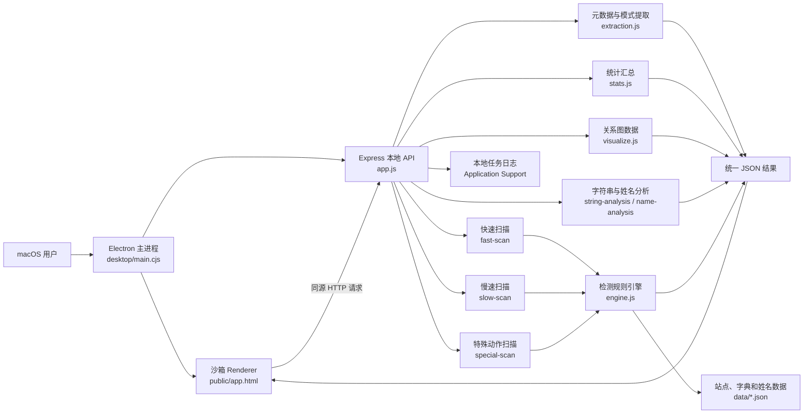
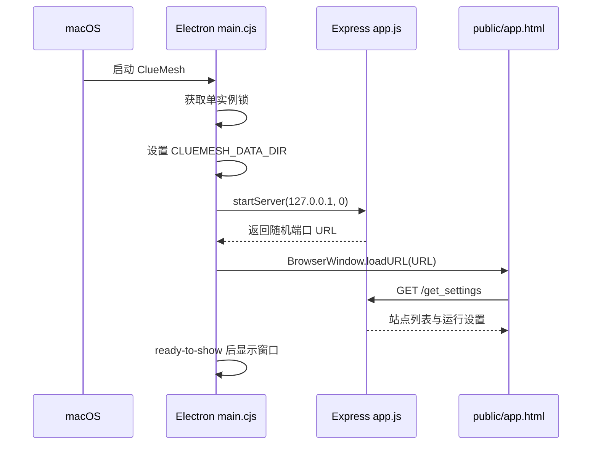
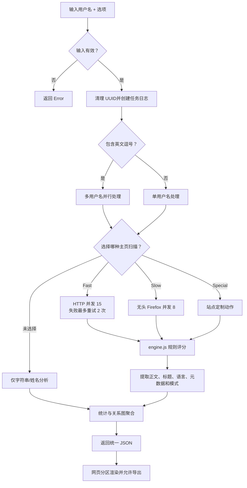
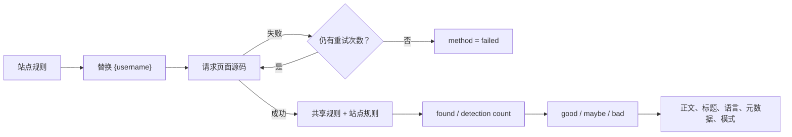

# ClueMesh 代码架构与工作原理

本文面向希望阅读、维护或二次开发 ClueMesh 的开发者。它从桌面应用启动、请求编排、扫描引擎、结果聚合和安全边界五个角度梳理代码。

## 1. 总体架构

桌面端不是把 Node.js 能力直接暴露给网页，而是在应用内部启动一个只监听 `127.0.0.1` 的 Express 服务。Electron Renderer 通过同源 HTTP 调用服务端接口，外部个人主页则交给系统默认浏览器打开。

## 2. 启动过程

关键点：

- `port: 0` 让操作系统分配空闲端口，避免固定端口冲突。
- `CLUEMESH_DATA_DIR` 指向 `~/Library/Application Support/cluemesh/`，日志与运行数据不写入只读应用包。
- `contextIsolation: true`、`nodeIntegration: false`、`sandbox: true` 隔离 Renderer 和 Node.js。
- `setWindowOpenHandler` 与 `will-navigate` 拦截外部导航，通过 `shell.openExternal` 交给默认浏览器。

## 3. 一次分析请求如何执行

主界面的 `analyze_string()` 收集输入和选项，生成随机任务编号，然后调用 `POST /analyze_string`。`app.js` 按选项编排各模块，最终返回一个统一 JSON 对象。

扫描互斥由服务端再次校验：一旦启用快速扫描，慢速扫描和特殊扫描会被跳过并写入警告日志，避免同一任务重复消耗资源。

## 4. 快速扫描的判定逻辑

`modules/fast-scan.js` 读取已选站点，为每个 URL 替换 `{username}`，以最多 15 个并发请求抓取页面。网络失败的站点会进入重试队列，最多执行三轮。

`Rate` 是规则命中率，而不是身份置信概率。页面模板、验证码、同名用户和站点改版都会影响结果，因此所有候选主页都需要人工核验。

## 5. 主要模块索引

| 文件 | 职责 | 主要入口 |
|---|---|---|
| `desktop/main.cjs` | Electron 生命周期、菜单、本地服务、窗口安全与外链 | `startBackend()`、`createWindow()` |
| `app.js` | Express 路由、任务编排、CLI 与统一输出 | `POST /analyze_string`、`startServer()` |
| `modules/helper.js` | 配置、数据装载、HTTP 请求、语言/国家辅助、日志和取消锁 | `get_url_wrapper_*()`、`log_to_file_queue()` |
| `modules/string-analysis.js` | 数字、符号、大小写、词典和候选词拆分 | `analyze_string()` |
| `modules/name-analysis.js` | 姓名来源、相似姓名和性别候选 | `find_origins()` |
| `modules/fast-scan.js` | HTTP 并发扫描与重试 | `find_username_normal()` |
| `modules/slow-scan.js` | Selenium/Firefox 深度加载与截图 | `find_username_advanced()` |
| `modules/special-scan.js` | 少数站点的定制浏览器动作 | `find_username_special()` |
| `modules/engine.js` | 执行共享规则和站点规则并计算命中 | `detect()`、`detect_logic()` |
| `modules/extraction.js` | 页面元数据和预定义模式提取 | `extract_metadata()`、`extract_patterns()` |
| `modules/external-apis.js` | 普通搜索、定制搜索和单词信息 | `check_engines()` |
| `modules/stats.js` | 类别、国家和元数据统计 | `get_stats()` |
| `modules/visualize.js` | 把用户名、主页和元数据转换为图节点/边 | `visualize_force_graph()` |
| `public/app.html` | 主界面、设置、请求、结果渲染和 JSON 导出 | `analyze_string()` |
| `public/graph.html` | 交互式证据关系图容器 | `ixora_wrapper()` |
| `data/sites.json` | 站点 URL、检测规则、排名和类别 | `websites_entries` |

## 6. 本地 API

| 方法与路径 | 用途 |
|---|---|
| `GET /get_settings` | 读取 User-Agent、代理、Google 配置掩码和站点列表 |
| `POST /save_settings` | 更新当前进程内的设置和站点选择 |
| `POST /analyze_string` | 执行完整分析并返回统一 JSON |
| `POST /get_logs` | 轮询指定任务的最新日志行 |
| `POST /cancel` | 把任务 UUID 加入取消锁 |
| `GET /generate` | 生成候选字符串排列组合 |

## 7. 结果数据结构

`POST /analyze_string` 返回的核心字段如下：

| 字段 | 内容 |
|---|---|
| `username`、`uuid` | 原始输入和任务编号 |
| `table`、`ages`、`names_origins` | 字符串与姓名分析结果 |
| `info`、`custom_search`、`words_info` | 搜索与外部词义结果 |
| `user_info_normal` | HTTP 快速扫描结果 |
| `user_info_advanced` | Firefox 慢速扫描结果和可选截图 |
| `user_info_special` | 特殊动作扫描结果 |
| `stats` | 类别、国家和元数据统计 |
| `graph` | 证据图的节点和边 |
| `logs` | 本次任务的日志文本 |

Renderer 根据字段是否有内容决定显示哪些区块。导出 JSON 时会移除交互式图对象，减少文件体积。

## 8. 取消、日志与故障边界

- 每次分析生成随机 UUID，日志文件按 UUID 分离。
- 页面每秒调用 `/get_logs`，显示最新执行步骤。
- 用户取消后，UUID 被放入 `helper.global_lock`；扫描循环在派发新站点前检查该锁。
- 单个站点失败通常转换为失败记录，不应中断整个批次。
- Express 全局错误处理返回 `Error`，详细排查以本地日志为准。

## 9. 二次开发入口

- 新增站点：优先修改 `data/sites.json`，为 URL 和检测条件建立数据规则。
- 新增通用检测：修改 `modules/engine.js`，同时确认快速/慢速模式所需的数据源。
- 新增结果类型：在 `app.js` 聚合字段，并在 `public/app.html` 增加渲染区块。
- 新增桌面能力：放在 `desktop/main.cjs`，不要打开 Renderer 的 Node.js 权限。
- 修改日志目录：沿用 `CLUEMESH_DATA_DIR`，避免向 `.app` 包内写入运行数据。
